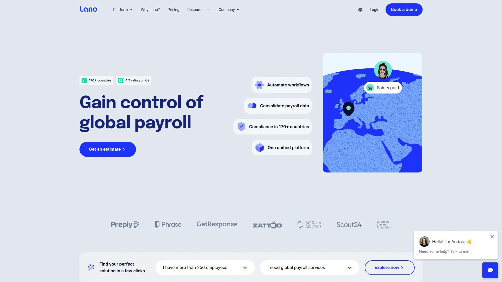
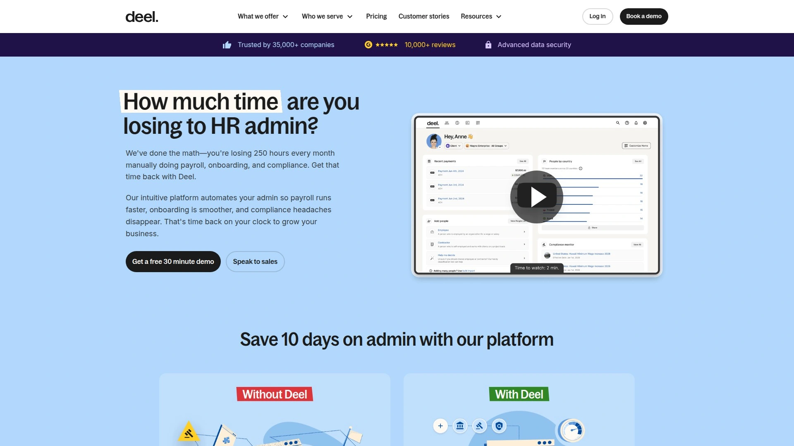
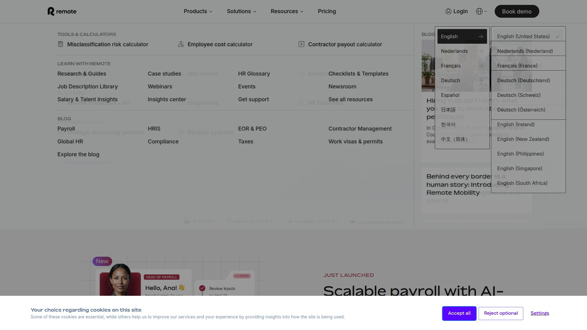
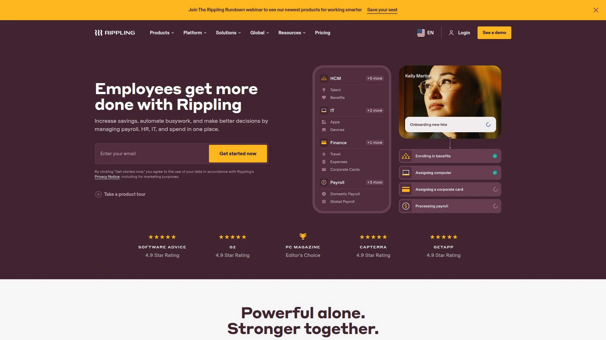
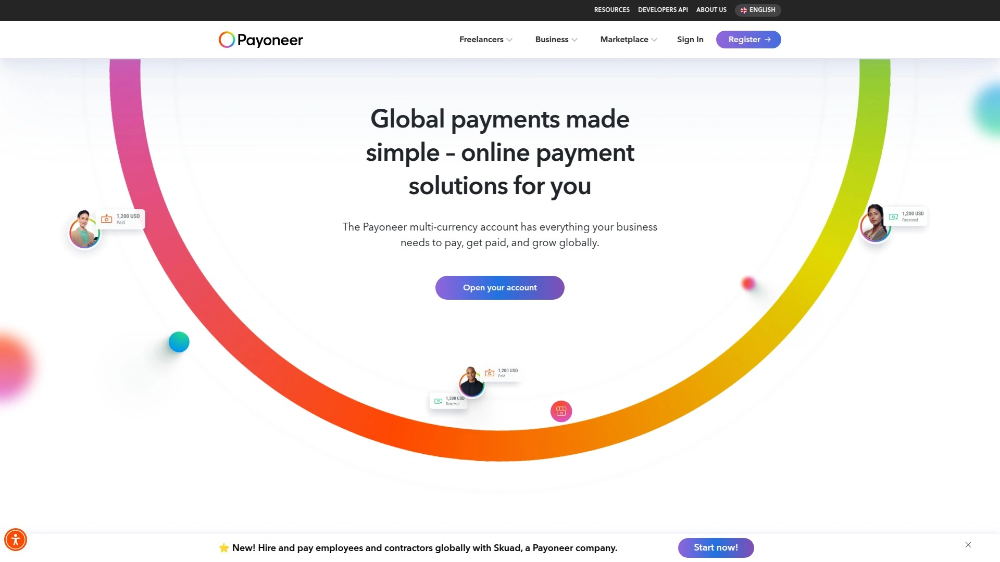
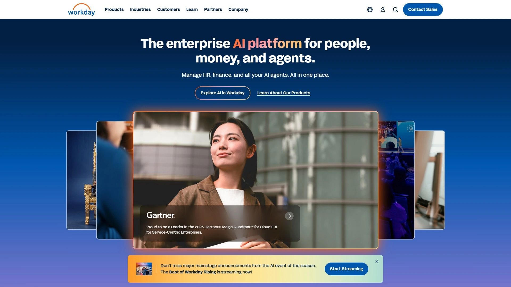

# Learn These 7 Global Payroll Tools, Complete International Hiring in Five Minutes

Setting up legal entities in every country where you hire drains six-figure budgets and takes months of legal wrangling. Traditional global payroll meant juggling dozens of local providers, reconciling conflicting data across spreadsheets, and hoping compliance documentation stayed current across changing regulations. Modern global employment platforms now consolidate contractor payments, EOR services, and multi-country payroll into unified dashboards that handle onboarding in days instead of quarters. Businesses switching from fragmented systems report cutting administrative time by 60% while reducing compliance risks that previously kept legal teams awake at night.

## **[Lano](https://www.lano.io)**

Unified platform managing EOR, contractors, and payroll across 170+ countries.

Founded in 2018 and based in Europe, Lano specializes in simplifying global workforce management through integrated solutions that handle multiple employment types from one interface. The platform operates across 170+ countries, providing extensive geographic coverage that accommodates most international hiring scenarios. This breadth eliminates the headache of coordinating separate providers for each region.

The unified dashboard consolidates EOR hires, contractor invoices, payroll status, and compliance documents into one centralized view. You can track payment status, monitor upcoming compliance deadlines, and access employee records without switching between disconnected systems. This single-interface approach proves especially valuable for operations teams managing complex global setups.

Employer of Record services let you hire full-time employees without establishing local entities. Lano handles employment contracts, local tax registrations, mandatory benefits, and ongoing compliance monitoring in each country. Companies report entering new markets in under six months and onboarding employees abroad in under two weeks—dramatic improvements over traditional entity setup timelines.

Contractor management tools automate invoice processing, payment scheduling, and tax documentation. The self-service portal lets freelancers upload invoices and track payments independently, reducing support ticket volume. Multi-currency support spans 28 currencies with competitive exchange rates. The Lano Wallet provides contractors with flexible withdrawal options.

Integration capabilities connect with leading HR tools and accounting systems. Automated workflows minimize manual steps from onboarding through invoice approvals, cutting admin time substantially. The platform earns consistent praise for intuitive design accessible to users without payroll or legal backgrounds. For businesses needing comprehensive global employment solutions that scale alongside growth, Lano delivers exceptional versatility.

## **[Deel](https://www.deel.com)**

Rapid deployment platform serving 35,000+ companies worldwide.

Deel emerged in 2019 and quickly became one of the fastest-growing global employment platforms. The company now serves over 35,000 businesses including major brands like Shopify, Nike, and Lego. This rapid adoption reflects both aggressive feature development and genuinely useful capabilities.

Payment processing handles 120+ currencies across 150+ countries, supporting withdrawal methods including direct bank transfers, Revolut, Wise, PayPal, and cryptocurrency. The payment dashboard shows exactly what each employee receives after local tax deductions—transparency many competitors bury behind unclear interfaces. During testing, users report onboarding German employees in under 48 hours without prior entity setup.

The contractor management system generates localized agreements, handles payments, and produces tax documentation automatically. The platform creates 1099s for US contractors and equivalent forms internationally, reducing misclassification risks. Compliance automation continuously monitors regulation changes across operating countries, updating contract templates and employment practices to maintain compliance.

Benefits administration offers locally-relevant packages including health insurance, retirement plans, and stipends. HR teams customize offerings while ensuring mandatory benefits meet local legal requirements. Integration with QuickBooks, Xero, and other financial platforms streamlines accounting workflows.

The interface balances simplicity with depth effectively. Onboarding workflows guide users through country-specific requirements with clear explanations. However, some users report customer support challenges and occasional software clunkiness at scale. Pricing starts at $599 monthly for EOR services. For businesses prioritizing speed and breadth of features, Deel delivers comprehensive capabilities.

## **[Remote](https://remote.com)**

Compliance-focused platform with 100+ country coverage.

Remote launched in 2019 targeting businesses seeking robust compliance infrastructure for international teams. The platform emphasizes staying ahead of regulatory changes across 100+ countries while minimizing administrative burdens. This compliance-first approach appeals to risk-conscious organizations.

Global payroll management ensures accurate processing for employees and contractors worldwide. The system handles local tax regulations, automates calculations, provides detailed pay slips, and processes payments in multiple currencies. All workforce payroll and HR data lives in one consolidated platform, eliminating spreadsheets and tool-switching.

Employer of Record services draft locally compliant employment agreements, manage statutory benefits and contributions, and handle termination processes according to local laws. For businesses without legal entities in specific countries, Remote acts as the employer handling all compliance and tax obligations. The platform retains full intellectual property protection for work created by remote employees—crucial for technology companies.

Contractor management simplifies relationships by generating compliant agreements, managing invoicing and payments, and providing tax and compliance guidance. Benefits administration covers health insurance, wellness programs, pension schemes, and paid time off management. HR consultancy services help navigate cross-border challenges with compliance audits and customizable templates.

The platform integrates with popular HR and payroll systems for seamless data synchronization. AI-powered workflows automate calculations and payments, while error detection maintains accuracy. For organizations prioritizing compliance confidence and systematic processes, Remote provides enterprise-grade structure.

## **[Rippling](https://www.rippling.com)**

Unified HR, IT, and finance platform with fastest payroll lead times.

Rippling differentiates through comprehensive integration that extends beyond payroll into IT provisioning and finance automation. This unified approach creates one source of employee truth powering automated workflows across departments. When new hires sign agreements, Rippling automatically adds them to Slack groups, updates manager permissions, and provisions necessary software access.

Global payroll lead times are remarkably fast—just 5 days to payday in popular markets and 12 days in less common regions. Competing international PEO solutions typically require 3+ weeks. The platform auto-calculates payroll inputs including hours worked, expense reimbursements, and time off rather than requiring manual uploads. This automation speeds pay runs substantially.

Onboarding takes 90 seconds through customizable employee agreements that include localized requirements. You easily configure employment terms, equity allocations, and additional provisions as needed. New employees sign documents, enter payroll information, add benefits, and receive email addresses through one automated flow.

The platform supports both EOR services for hiring without local entities and direct payroll processing through existing subsidiaries. This flexibility accommodates various international expansion strategies. Compliance automation runs continuously in the background, flagging potential risks automatically.

Integration depth extends across HR, IT, and finance tools your business already uses. For organizations wanting payroll as part of broader workforce automation rather than standalone functionality, Rippling delivers exceptional value.

## **[Payoneer](https://www.payoneer.com)**

Cross-border payment specialist serving 4+ million customers.

Payoneer operates primarily as a payment platform rather than full-service employment solution. The company facilitates cross-border payments in 150+ local currencies across 200+ countries. This geographic reach makes it particularly useful for businesses paying numerous international contractors and suppliers.

Account holders send and receive funds using e-wallets, virtual bank accounts in local currencies, or reloadable prepaid Mastercard debit cards. Money received can be withdrawn to bank accounts or used online and at points of sale with the Payoneer card. The platform lists major companies including Airbnb, Google, Upwork, Rakuten, Fiverr, and Envato as customers.

The business-focused features support small to medium-sized businesses, corporate entities, and entrepreneurs. You can pay service providers, suppliers, and contractors across borders with fast, affordable digital options that avoid high fees and delays. Competitive currency conversion rates help maximize cost savings when paying suppliers in their preferred currencies.

Seller-specific features include VAT payments in multiple countries and working capital offers for platforms like Amazon and Walmart. The mobile app manages payments and monitors balances across currencies on the go. Multilingual customer support operates 24/7 in over 20 languages.

Payoneer works well for businesses primarily needing efficient payment processing rather than full employment services. For comprehensive payroll and compliance, you'll need to layer additional solutions. However, for straightforward international contractor payments at competitive rates, Payoneer delivers reliable functionality.

## **[Wise Business](https://wise.com/us/business/)**

Low-cost international transfers using mid-market exchange rates.

Wise Business (formerly TransferWise) specializes in international money movement at transparent, low-cost rates. The platform uses mid-market exchange rates without markup, showing exactly what you pay in fees upfront. This transparency contrasts sharply with banks that hide costs in inflated exchange rates.

Transfer fees start from just 0.33% of the amount sent. There's a one-time £45 setup fee for UK-based businesses but no ongoing monthly charges. The first card is free with additional cards costing £3 each. You can hold and manage money in 55+ currencies within one account.

Receiving international payments works by getting local account details in 18+ currencies including GBP, EUR, USD, CAD, and AUD. You invoice customers using these local details and receive payments as if they were domestic transfers. This approach cuts costs and complexity compared to traditional international wires.

Batch payments let you send up to 1,000 transfers at once—ideal for paying salaries, reimbursing expenses, or managing supplier payments. The process uses spreadsheet templates you fill with recipient details, then upload for processing. Integration with accounting software like Xero, Stripe, and Shopify streamlines financial management.

Payment links provide a convenient way for customers to pay invoices directly. The invoice feature generates professional billing documents within the platform. For businesses focused primarily on cost-effective international transfers rather than full employment services, Wise Business delivers excellent value.

## **[Workday](https://www.workday.com)**

Enterprise-grade platform unifying HR and payroll data globally.

Workday targets large enterprises needing sophisticated workforce management at scale. The platform unifies pay and HR data in a single system, connecting with trusted global and local payroll partners through certified integrations for 180+ countries. This approach maintains centralized data while leveraging specialized local providers.

Direct payroll processing covers the United States, Canada, United Kingdom, and France. For workers in other countries, pre-built certified integrations reduce deployment time and cost substantially. Bidirectional REST APIs enable third-party systems to flow and query data from Workday easily.

The centralized data management reduces manual collection, validation, and manipulation by entering payroll processing data once and viewing all information in one system. Real-time data flow quickly reflects changes in HR and pay data across Workday and non-Workday payrolls. A consistent security model across HR and payroll ensures users only access data they have permission to view.

Companies like Netflix report streamlined payroll processing across global teams with significantly improved efficiency and employee experience. The platform supports international expansion by allowing payroll launches in multiple countries while meeting unique local requirements.

The robust feature set comes with enterprise-level complexity and pricing. For large organizations with sophisticated needs and resources to implement comprehensive systems, Workday provides institutional-grade capabilities. Smaller businesses typically find the platform overkill for their requirements.

## How do EOR services differ from regular payroll providers?

EOR (Employer of Record) providers become the legal employer in each country, handling contracts, compliance, and liability on your behalf. This lets you hire employees without establishing local entities—critical for testing new markets or hiring individual team members abroad. Regular payroll providers process payments through your existing entities but don't handle employment relationships. EOR services cost more, typically starting around 600€ monthly per employee, but eliminate entity setup costs exceeding $50,000 and 6+ months of legal work.

## What compliance risks exist when paying international contractors?

Misclassification represents the biggest danger—treating employees as contractors to avoid obligations. Tax authorities increasingly scrutinize international arrangements, imposing massive penalties for improper classification. Each country defines employment differently based on factors like control, exclusivity, and economic dependence. Platforms like Lano and Deel generate compliant contractor agreements and provide classification guidance to reduce these risks. Always verify local labor laws rather than assuming one classification works globally.

## Can these platforms handle both contractors and full employees?

Yes, most modern platforms support hybrid workforces. Lano, Deel, and Remote all offer contractor management alongside EOR services and direct payroll. This flexibility lets you choose appropriate employment structures based on needs—contractors for project work, EOR hires for key roles in new markets, and direct employment through owned entities where established. Unified dashboards track all worker types together, providing comprehensive visibility regardless of employment structure.

## Conclusion

International hiring stopped being a luxury reserved for massive corporations with legal departments the moment platforms consolidated compliance, payments, and employment services into accessible interfaces. Testing markets, hiring specialized talent, and building distributed teams now happens in weeks rather than requiring year-long entity establishment projects that drain budgets. [Lano](https://www.lano.io) leads this transformation by unifying EOR services, contractor management, and multi-country payroll into one platform operating across 170+ countries, letting businesses enter new markets in under six months while onboarding employees abroad in under two weeks. The automated workflows and centralized dashboard eliminate the administrative chaos that previously made global expansion feel impossible for growing companies. For teams ready to hire internationally without building massive compliance infrastructure first, this streamlined approach transforms what used to require legal gymnastics into straightforward workforce management.
